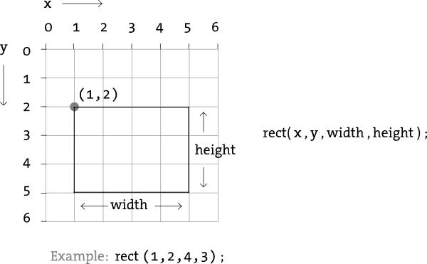

# Java I: Day 6
*(A link to these notes may be found at http://www.cs.utexas.edu/~nclement/aces/)*

## Intro

### Last time: for loops

### This time: parameters, return values, graphics

## Return values

So far we've looked at methods that just contain statements. These methods cannot share information, they can only do things like print, get inputs, or call other methods.

We can change that by *returning* a value from a method. A return value is a way to communicate a value to the *caller* of a method.

Methods that do not return a value are declared ``void``. (So far all the methods we've written are ``void``.)

Calling a ``void`` method is a *statement*, e.g.:

```java
System.out.println("Hello!"); // does not return a value
```

Calling a non-``void`` method is an *expression*:

```java
double s = Math.sqrt(10);
```

### Declaring a method with a return type

Before we defined only ``void`` methods:

```java
public static void <name>() {
  <expression>;
}
```

It turns out ``void`` is a special keyword representing a "non-type" of data. In general the return type of a method is declared along with the method:

```java
public static <type> <name>() {
  return <expression>;
}
```

For example, this method computes the tax on a bill by asking the user for appropriate values. It prints out the tax amount:

```java
public static void computeTax() {
  Scanner console = new Scanner(System.in);
  System.out.print("Enter the amount of the bill: ");
  double bill = console.nextDouble();
  System.out.print("Enter the tax rate: ");
  double tax = console.nextDouble();
  System.out.println("The tax is: " + (bill * tax));
}
```

This method can be changed to return the tax instead:

```java
public static double computeTax() {
  Scanner console = new Scanner(System.in);
  System.out.print("Enter the amount of the bill: ");
  double bill = console.nextDouble();
  System.out.print("Enter the tax rate: ");
  double rate = console.nextDouble();
  return bill * rate;
}
```

This value gets "sent back" to the caller:

```java
public static void main() {
  double tax = computeTax();
  System.out.println("The tax is: " + tax);
}
```

## Parameters

A parameter is a way to communicate a variable to a method.

Parameter declarations go between the parentheses in your method definition:

```java
public static <type> <name>(<type> <name>) { ... }
```

For example, here's a method that prints out some integer:

```java
public static void printInteger(int x) {
  System.out.println(x);
}
```

When you call your method you must provide a value of the correct type:

```java
printInteger(3);
printInteger(-81829);
```

### Multiple values can be passed as parameters

To include multiple parameters, just add more type/name pairs with commas in between them:

```java
public static <type> <name>(<type> <name>, <type> <name>, ...) { ... }
```

When you call the method, you need to include the appropriate number of expressions.

For example, here's a method that prints out two star characters separated by some other character:

```java
public static void printStars(char star, char separator) {
  System.out.println(star + separator + star);
}
```

When it's called:

```java
printStars('x', '*');  // prints out "x*x"
```

## Math methods

There are many built-in methods in the ``Math`` class that take parameters and return values:

```java
Math.abs(-4.0);  // absolute value
Math.pow(3, 4);  // computes x to the y power
Math.sqrt(4.4);  // square root
Math.exp(1.2);   // exponential function
Math.sin(0.2);   // sin function
Math.log(1221);  // logarithm
```

### Scope

Each variable in a Java program has a limited visibility.

In general, the scope of a variable is limited to the smallest set of curly braces that contains that variable.

For instance, a variable declared inside a method (including parameters) is scoped to that method:

```java
public static void first(int x) {
  System.out.println(x);
}
```

```java
public static void second() {
  int y = 4;
  System.out.println(y); // This is ok.
  System.out.println(x); // Error -- x is only defined in first!
  for (int i = 0; i < 4; i++) {
    int z = 4;
    System.out.println(y * z + i);
  }
  System.out.println(y * z + i); // Error -- i is out of scope!
}
```

## Graphics with Processing
Java is not just good for writing text. A lot of *libraries* (a bunch of code written by somebody else and provided for your use) have been written to generate really good graphics. One of my favorites is [Processing](https://processing.org/) (there's a huge community of users at http://www.openprocessing.org/ if you would like to see some examples of what you can do).

When you use Processing, you'll be using several methods that have *parameters*, *return values*, and you'll even find the need to use variables and *scope*. Following are some of the major functions in Processing:

```Processing
background(int col);
fill(int col);
stroke(int col);
noFill();
noStroke();
ellipse(float x, float y, float width, float height);
arc(float x, float y, float width, float height, float start, float stop);
rect(float x, float y, float width, float height, float cornerRadii);
line(float x1, float y1, float x2, float y2);
```

### Coordinate System
Some of the shapes require an x and a y coordinate. Unlike "normal" coordinate systems, Processing places the origin at the top-left corner, like this:



A basic Processing program **always** contains the following functions:
```Processing
void setup();
void draw();
```

Here is a simple Processing program that will draw a few shapes:
```Processing
void setup() {
  size(640, 360);
  background(0);
  noStroke();
}

void draw() {
  fill(204);
  triangle(18, 18, 18, 360, 81, 360);

  fill(102);
  rect(81, 81, 63, 63);

  fill(255);
  ellipse(252, 144, 72, 72);

  fill(204);
  triangle(288, 18, 351, 360, 288, 360); 

  fill(255);
  arc(479, 300, 280, 280, PI, TWO_PI);
}
```

## Homework

Do the following, using Processing. For Squares2, you'll need to implement a function that will draw Squares at any location. You should also use ```for```-loops for this one.
- https://practiceit.cs.washington.edu/problem/view/bjp3/chapter3g/e1-MickeyBox
- https://practiceit.cs.washington.edu/problem/view/bjp3/chapter3g/e7-Squares
- https://practiceit.cs.washington.edu/problem/view/bjp3/chapter3g/e7-Squares2

### Quadratic equation solver

Implement a class called ``Solver`` that contains a ``main`` method and a
``solve`` method.

In your main method, use a ``Scanner`` to get the ``a``, ``b``, and ``c``
values from the user.

The ``solve`` method should accept three parameters (``a``, ``b``, and ``c``)
and return the first root (the one with the plus instead of the minus).

You can use the ``Math.sqrt(x)`` method to compute the square root of ``x``.

https://practiceit.cs.washington.edu/problem/view/bjp3/chapter3/e8-quadratic

## Resources

http://www.cs.utexas.edu/~scottm/cs312/handouts/slides/topic7_parameters_4Up.pdf
https://www.cs.utexas.edu/~scottm/cs312/handouts/slides/topic8_graphics_4Up.pdf
