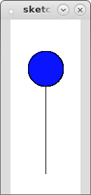
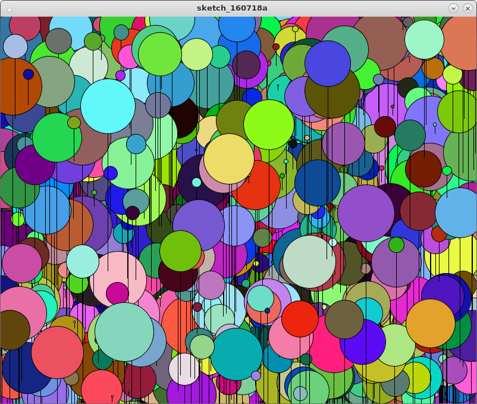
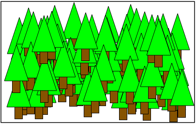

# Java I: Day 7
*(A link to these notes may be found at http://www.cs.utexas.edu/~nclement/aces/)*

## Intro

### Last time: intro to graphics

### This time: functions, breaking up problems

## Use for functions

Consider the following problem:
> **Quadratic equation solver**
>
> Implement a class called ``Solver`` that contains a ``main`` method and a
> ``solve`` method.
>
> In your main method, use a ``Scanner`` to get the ``a``, ``b``, and ``c``
> values from the user.
>
> The ``solve`` method should accept three parameters (``a``, ``b``, and ``c``)
> and return the first root (the one with the plus instead of the minus).
>
>You can use the ``Math.sqrt(x)`` method to compute the square root of ``x``.
>
>https://practiceit.cs.washington.edu/problem/view/bjp3/chapter3/e8-quadratic

Why would you want to include functions in your code?

Consider the following (ASCII) images:
```
*************

*******

***********************************

**********
*        *
**********

*****
*   *
*   *
*****
```
Is there any obvious redundancy? Can we write a function? 
 - `public static void printStars(int num)`
 - `public static void printRect(int height, int width)`

What if we wanted to *extend* our code for other uses?
 - `public static void printRect(int height, int width, String val)`

<dl>
 <dt>Try This</dt>
 <dd>Create a single function, `printRect(height, width, val)` that uses
     a function `printLine(number, val)` and doesn't actually print anything
     out itself</dd>
</dl>

### Functions in Graphics

Functions are also useful for graphics. Consider the following image:



Design a function that can be used to create many balloons of different sizes and colors.



## Random
Sometimes you know exactly what you want. Other times you want something completely random. For this, there is `random`:
```Processing
random(float high);
random(float low, float high);
```

The first function will generate a random number between 0 and `high` (not including `high`) and the second function will generate a number between `low` and `high` (not including `high`.

This is really useful for creating lots of graphics. If you did this right, you should be able to generate the **balloons** image with only 20 lines of Processing code.

## Homework

 - Write a function, `printPrimes(a, b)` that will print all the prime numbers between two numbers. For example, `printPrimes(5, 10)` should print `5 7` and `printPrimes(70, 100)` should print `71 73 79 83 89 97`. You should probably use additional functions.
 - Write a program in Processing that will produce something like the following image. You should have a single function that produces a single tree.

  

## Resources

http://www.cs.utexas.edu/~scottm/cs312/handouts/slides/topic7_parameters_4Up.pdf
https://www.cs.utexas.edu/~scottm/cs312/handouts/slides/topic9_more_graphics_4Up.pdf
